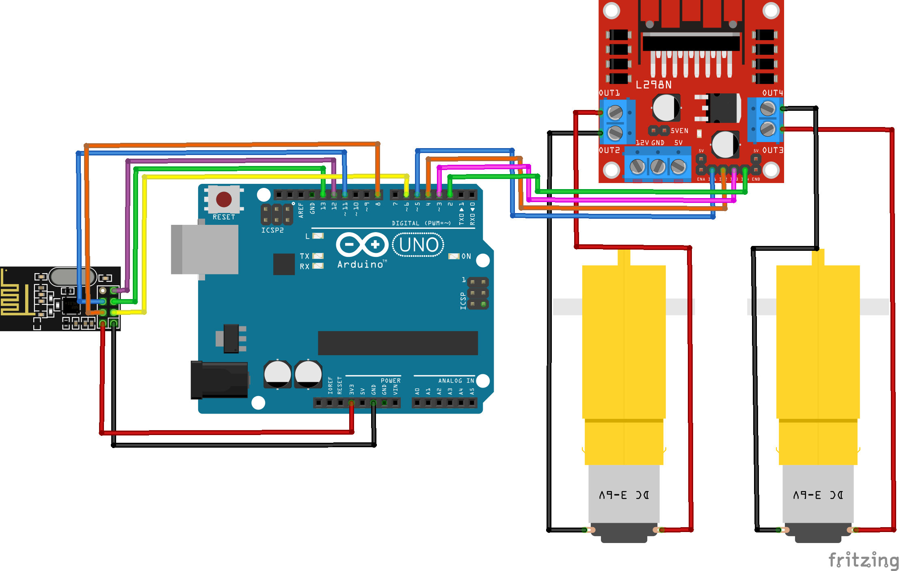

# Carro Inalámbrico con módulo nRF24L01 
En esta sesión aprenderemos cómo construir un carro inalámbrico utilizando el módulo NRF24L01.

En la robótica, la comunicación inalámbrica es esencial para permitir que los robots interactúen de manera remota. El módulo NRF24L01 es un dispositivo de comunicación inalámbrica de bajo costo que utiliza la banda de frecuencia de 2.4GHz. Este módulo es muy utilizado en proyectos de robótica y automatización ya que permite la comunicación inalámbrica entre dispositivos a larga distancia.

## Materiales
* 2 x Arduino Uno
* 2 x Módulo Inalámbrico nRF24L01 (antena opcional)
* 1 x Chasis carro de 2 motores
* 1 x Módulo Puente H L298N
* 1 x Joystick Shield
* Cables Dupont o puentes para protoboard

## Instrucciones
### Joystick (Arduino #1)
1. Descargar el codigo joystick_shield_nRF24L01.ino y abrirlo en el IDE de Arduino.
2. Revisar que el código este correcto y cargarlo al Arduino.
3. Revisar que el selector de voltaje del Joystick Shield se encuentre del lado de 3.3v
4. Conectar la antena nRF24L01 al Joystick Shield (debe de quedar hacia afuera del joystic).
5. Montar el Shield Joystick sobre el Arduino y revisar que encaje perfectamente iniciando desde los pines A5 y 0 (RX) de cada lado del Arduino.
### Carro Inalámbrico (Arduino #2)
1. Realizar las conexiones como se indica en el layout.
2. Descargar el codigo car_nRF24.ino y abrirlo en el IDE de Arduino.
3. Revisar que el código este correcto y cargarlo al Arduino.

## Layout
